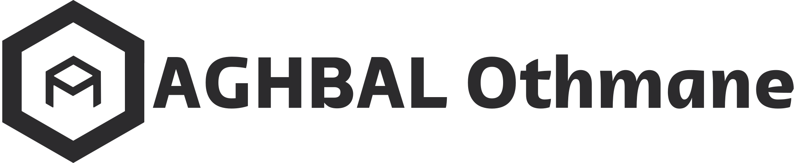
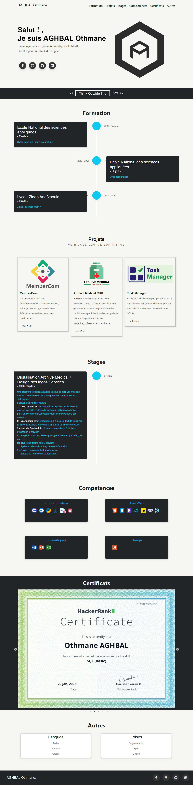

# Portfolio

portfolio personnel qui represente les competences , connaissances et experiences .

# Sommaire

#### 1. Introduction

#### 2. Composants

#### 3. Installation

#### 4. Technologies

#### 5. Screenshot

# Salut , je suis AGHBAL Othmane! 👋

On exploitant mes connaissances acquises pendant le cour du developpement web , j'ai réalisé ce portfolio en utilisant React, qui vOn exploitant mes connaissances acquises pendant le cour du developpement web , j'ai réalisé ce portfolio en utilisant React, qui va représenté mon CV personel .a représenté mon CV personel .

# Composants

Ce portfolio se compose en 7 sections plus le Header et Footer donc les composants sont:

#### 1.Home

=> reprente la totalité de la page et contient les autres composants

#### 2. Header

=> Represente l'entete du site

#### 3. HeroSection

=> La premiere section contient mon logo , un simple texte , et des mes contacts sur les reseaux sociaux

#### 4. Une simple phrase

=> Think Outside The Box

#### 5. Formation

=> Represente mon cursus académiques

#### 6. Projets

=> Des projets que j'ai deja realisé

#### 7. Stages

=> Les stages que j'ai passé

#### 8. Competences

=> Mes Connaissances dans les differents domaines

#### 9. Certificats

=> parmis les certificats aquises

#### 10. Autres

=> Langues & loisirs

#### 11.Footer

=> bas de la page

# Installations

Pour installer et exécuter ce portfolio sur votre ordinateur local, suivez ces étapes :

##### 1. Téléchargez ou clonez le dépôt git sur votre ordinateur

##### 2. Ouvrez le terminal et accédez au répertoire du projet

##### 3. Installez les dépendances en utilisant la commande npm install

##### 4. Démarrez le serveur de développement en utilisant la commande npm start

##### 5. Ouvrez votre navigateur et accédez à l'adresse http://localhost:3000 pour voir le portfolio

# Technologies

Les technologies utilisé :

##### 1. React

##### 2. Font Awsome (pour les icones)

# Screenshot

